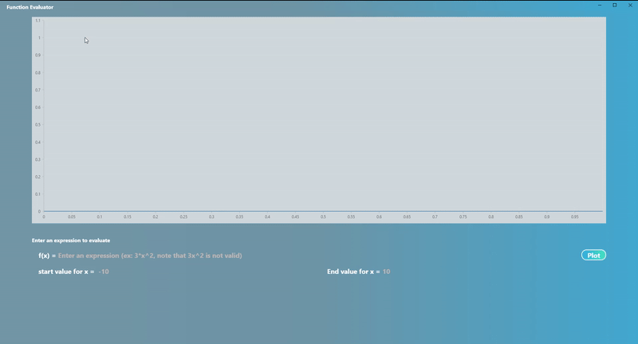
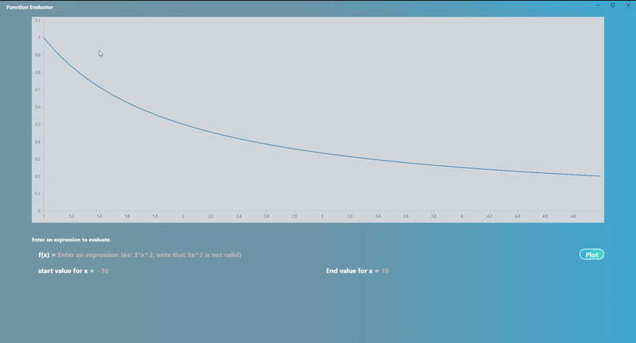

# SEI_T01_FuncPlotter

Function Plotter Task built in flutter. A desktop application that plots user defined functions.

  - Supported operators are: + - * / ^ (ex: 2+4, 5*7, etc)
  
  - Supports Decimal numbers (1.2, 3/5, etc)
  
  - Supports Plotting a Variable X (2*x, 3*X^2, etc... Note that 3X is not valid)
  
  - Supports showing alerts when the user inputs invalid expressions or range

## How to run the App
To run the Application, got to **FunctionPlotter\Release** and run **function_plotter.exe**, The other files in the folder (.dll for example) are needed for this app to run, please do copy the entire **Release** folder if you want to move the project elsewhere.

### Here is how the plotter looks like in action 

### Here is some Invalid inputs and how the app handles them

More Videos and images are available in the Captures folder. 

## License

    The MIT License (MIT)

    Copyright (c) 2022 Youssef Zakaria

    Permission is hereby granted, free of charge, to any person obtaining a copy
    of this software and associated documentation files (the "Software"), to deal
    in the Software without restriction, including without limitation the rights
    to use, copy, modify, merge, publish, distribute, sublicense, and/or sell
    copies of the Software, and to permit persons to whom the Software is
    furnished to do so, subject to the following conditions:

    The above copyright notice and this permission notice shall be included in all
    copies or substantial portions of the Software.

    THE SOFTWARE IS PROVIDED "AS IS", WITHOUT WARRANTY OF ANY KIND, EXPRESS OR
    IMPLIED, INCLUDING BUT NOT LIMITED TO THE WARRANTIES OF MERCHANTABILITY,
    FITNESS FOR A PARTICULAR PURPOSE AND NONINFRINGEMENT. IN NO EVENT SHALL THE
    AUTHORS OR COPYRIGHT HOLDERS BE LIABLE FOR ANY CLAIM, DAMAGES OR OTHER
    LIABILITY, WHETHER IN AN ACTION OF CONTRACT, TORT OR OTHERWISE, ARISING FROM,
    OUT OF OR IN CONNECTION WITH THE SOFTWARE OR THE USE OR OTHER DEALINGS IN THE
    SOFTWARE.
